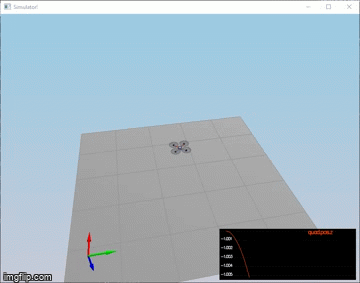
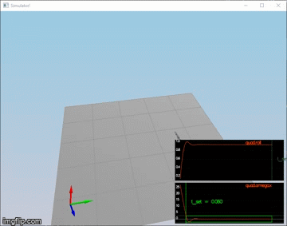
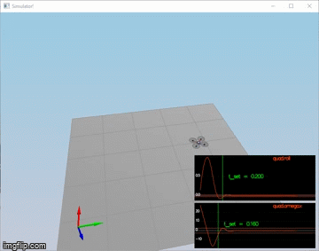
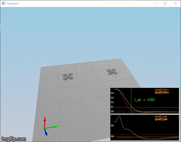
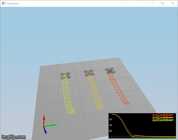
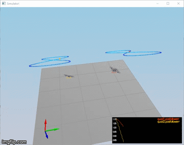

### Testing it Out (scenario 1)###

I modified the `Mass` parameter in `QuadControlParams.txt` to make it match the actual vehicle mass (given in `QuadPhysicalParams.txt`). The vehicle now more or less stays in the same spot.

With the proper mass, your simulation should look a little like this:

### Body rate and roll/pitch control (scenario 2) ###

I implemented the body rate and roll / pitch control.  For the simulation, I used `Scenario 2`.  In this scenario, you will see a quad above the origin.  It is created with a small initial rotation speed about its roll axis.  My controller stabilizes the rotational motion and brings the vehicle back to level attitude.

I accomplished this in two steps.

1. Body rate control

 - I implemented the function `GenerateMotorCommands()`
 - I implement the function `BodyRateControl()`
 - I tuned `kpPQR` in `QuadControlParams.txt` to get the vehicle to stop spinning quickly but not overshoot

At this point, the rotation of the vehicle about roll (omega.x) get controlled to 0 while other rates remain zero.  Note that the vehicle keeps flying off quite quickly, since the angle is not yet being controlled back to 0. Also note that some overshoot will happen due to motor dynamics.

2. Roll / Pitch control
We won't be worrying about yaw just yet.

 - I implemented the function `RollPitchControl()`
 - I tuned `kpBank` in `QuadControlParams.txt` to minimize settling time but avoid too much overshoot

At this point, the quad level itself (as shown below), though it’ll still be flying away slowly since we’re not controlling velocity/position!  You should also see the vehicle angle (Roll) get controlled to 0.

### Position/velocity and yaw angle control (scenario 3) ###

Next, I implemented the position, altitude and yaw control for the quad.  For the simulation, I used `Scenario 3`.  This creates 2 identical quads, one offset from its target point (but initialized with yaw = 0) and second offset from target point but yaw = 45 degrees.

 - I implemented the function `LateralPositionControl()`
 - I implemented the function `AltitudeControl()`
 - I tuned parameters `kpPosXY` and `kpPosZ`
 - I tuned parameters `kpVelXY` and `kpVelZ`

At this point, the quads should be going to their destination points and tracking error should be going down (as shown below). However, one quad remains rotated in yaw.

 - I implemented the function `YawControl()`
 - I tuned parameters `kpYaw` and the 3rd (z) component of `kpPQR`

### Non-idealities and robustness (scenario 4) ###

In this part, I explored some of the non-idealities and robustness of a controller.  For this simulation, I used `Scenario 4`.  This is a configuration with 3 quads that are all are trying to move one meter forward.  However, this time, these quads are all a bit different:
 - The green quad has its center of mass shifted back
 - The orange vehicle is an ideal quad
 - The red vehicle is heavier than usual

1. I run my controller & parameter set from Step 3 and confirmed that not all the quads seem to be moving OK.

2. I edited `AltitudeControl()` to add basic integral control to help with the different-mass vehicle.

3. I  tuned the integral control, and other control parameters until all the quads successfully move properly.  

### Tracking trajectories (scenario 4) ###

Now that we have all the working parts of a controller, I will put it all together and test it's performance once again on a trajectory.  For this simulation, I used `Scenario 5`.  This scenario has two quadcopters:
 - the orange one is following `traj/FigureEight.txt`
 - the other one is following `traj/FigureEightFF.txt`

The quads follow the trajectory quite well.

